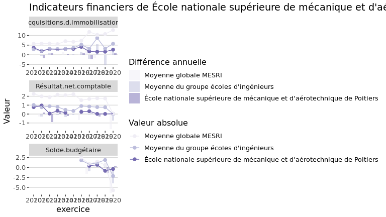
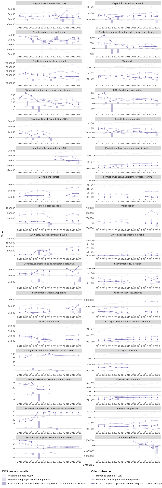

Indicateurs financiers d’établissement
================

# École nationale supérieure de mécanique et d’aérotechnique de Poitiers

## Focus Résultat et Solde

    ## Warning: Removed 30 rows containing missing values (geom_col).

    ## Warning: Removed 20 rows containing missing values (geom_point).

<!-- -->

## Tous les indicateurs

    ## Warning: Removed 304 rows containing missing values (geom_col).

    ## Warning: Removed 172 rows containing missing values (geom_point).

<!-- -->
